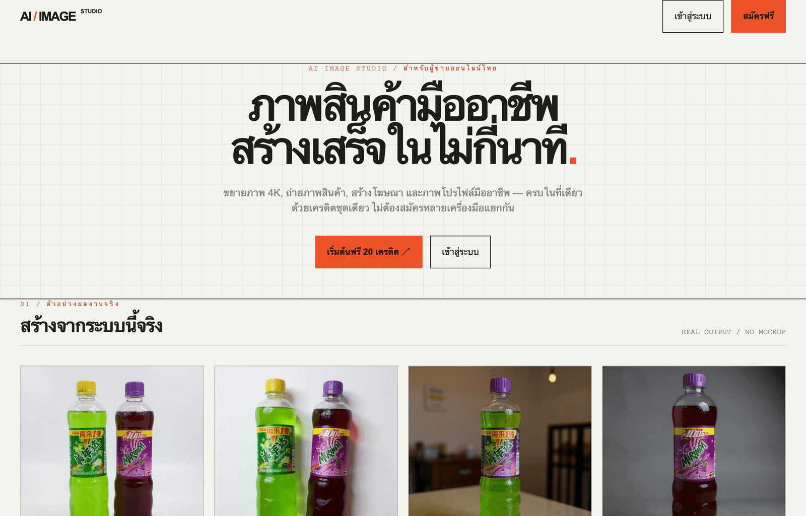
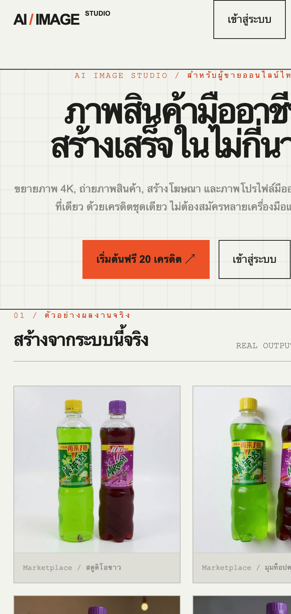
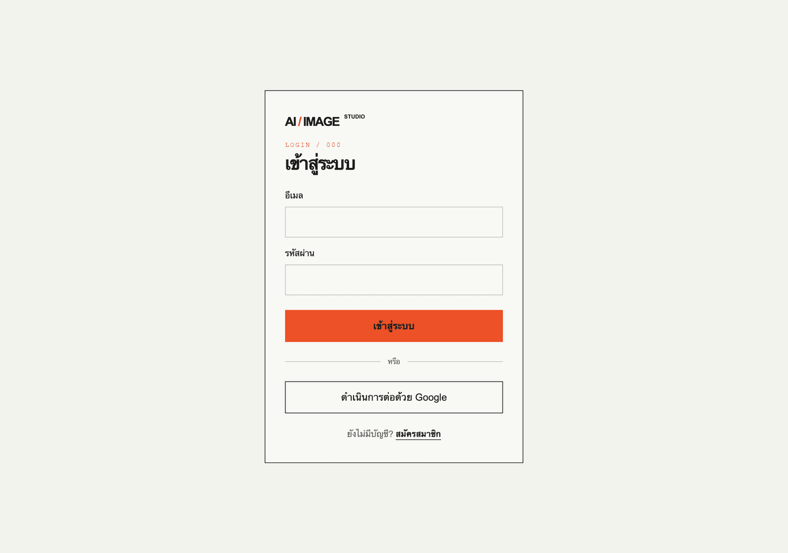

# AI Image Studio

A credit-based SaaS that turns a single phone photo of a product into marketplace-ready images — built for Thai online sellers listing on Shopee, Lazada and TikTok Shop.

[](https://github.com/nana14329245/AI-Image-Studio/actions/workflows/ci.yml)

Next.js 16 · React 19 · TypeScript · Supabase · Stripe · fal.ai



> The product UI is in Thai, because its users are. This README is in English.

## What it does

One upload, one credit balance, four tools:

| Tool | What it produces | Cost |
|---|---|---|
| **4K Upscale** | 2× (Clarity) or 4× (Topaz) enlargement | 4 credits |
| **Product Studio** | 4 commercial angles from one product photo | 6 credits |
| **Ad Studio** | Ad creative in multiple aspect ratios | 8 credits |
| **Professional Photo** | Portrait cleaned up for CVs and profiles | 6 credits |

**Brand Kit** stores a logo and brand colours once and reuses them across every generation — the logo is composited onto the output, and the colours are fed to the model as a mood hint rather than as rendered text.

New accounts get 24 credits — enough for one run of every tool. Paid plans are ฿299/month (500 credits) and ฿999/month (2,000 credits) via Stripe.

<p align="center">
  
  
</p>

## Architecture notes

The parts worth reading, and why they are the way they are:

**Credits are only spent on delivered work.** A generation is recorded before the provider is called, but credits are deducted only after the result has been fetched from fal.ai *and* written to Supabase Storage. A failed or lost generation costs the user nothing.

**Credit movements are idempotent.** `spend_credits` and `grant_credits` are Postgres functions, not application code, so concurrent requests cannot interleave into a double-spend. Subscription renewals are keyed on the Stripe event so a redelivered webhook cannot grant the same month's credits twice — see migrations `0005` and `0006`, both of which exist because the naive version was wrong.

**Generation survives an interrupted save.** Jobs are submitted to the fal.ai queue and polled through `/api/generations/[id]/status`, which is owner-scoped. A row stuck in `finalizing` for more than 90 seconds is reclaimed and retried, so a server restart mid-save does not strand the job or the credits.

**Two rate limits, one check.** `check_rate_limit` enforces a sliding window per user *and* per IP in a single round trip. It fails open on a database error — a limiter outage should not take generation down — but surfaces the error so it still gets logged.

**Secrets stay server-side.** The Supabase service-role key and `FAL_KEY` are only ever read in route handlers. `getSupabaseConfig` refuses to start the app if a secret key is found in a `NEXT_PUBLIC_` variable, since those are inlined into the client bundle.

## Running locally

Requires Node.js 20.9+.

```bash
npm ci
cp .env.example .env.local   # only if you don't have one yet
npm run dev
```

Fill in `.env.local`:

| Variable | Needed for |
|---|---|
| `NEXT_PUBLIC_SUPABASE_URL` | everything |
| `NEXT_PUBLIC_SUPABASE_PUBLISHABLE_KEY` | everything |
| `SUPABASE_SERVICE_ROLE_KEY` | image processing, webhooks |
| `FAL_KEY` | image generation |
| `STRIPE_SECRET_KEY`, `STRIPE_WEBHOOK_SECRET` | billing |
| `STRIPE_PRICE_PRO`, `STRIPE_PRICE_BUSINESS` | billing |
| `NEXT_PUBLIC_SITE_URL` | link previews, sitemap, robots.txt (crawling is blocked until set) |
| `NEXT_PUBLIC_POSTHOG_KEY`, `NEXT_PUBLIC_POSTHOG_HOST` | optional analytics — off when empty |

Without a valid Supabase URL and key the app redirects to `/setup` and the API returns 503 rather than silently skipping auth.

Setup problems are collected in [docs/troubleshooting-th.md](docs/troubleshooting-th.md) (Thai).

### Supabase

1. Apply every migration in `supabase/migrations/` in filename order (SQL editor, or `supabase db push`). They create `profiles`, `credit_ledger`, `generations`, `rate_limit_events`, the `spend_credits` / `grant_credits` / `check_rate_limit` functions, the RLS policies, and the `generations` storage bucket.
2. Auth → Providers: enable Email and Google.
3. Auth → URL Configuration: add your site URL and `/auth/callback`.
4. Storage: raise the `generations` bucket limit to 50 MB (migration `0003` does this; the project-wide limit must also allow it).

### Stripe

1. Create recurring prices for Pro and Business; put the IDs in `STRIPE_PRICE_PRO` / `STRIPE_PRICE_BUSINESS`.
2. Point a webhook at `/api/webhooks/stripe` for `checkout.session.completed`, `customer.subscription.updated`, `customer.subscription.deleted` and `invoice.paid`.
3. Locally: `stripe listen --forward-to localhost:3000/api/webhooks/stripe`.

## Development

```bash
npm run lint        # eslint
npm run typecheck   # tsc --noEmit
npm test            # vitest
npm run build       # production build
```

CI runs all four on every push, plus a secret scan on the commits each pull request adds.

Tests cover the logic where a mistake costs money or leaks something: Stripe price → plan mapping, upload data-URL validation, the allowlist that keeps free text out of generation prompts, brand-logo transparency, provider response parsing, client-IP extraction for rate limiting, and the config guard that keeps secret keys out of the client bundle.

## Status

Working: auth, password reset, credits, billing, all four tools with before/after comparison, gallery, brand kit, mobile navigation, dark mode.

Known gaps, roughly in priority order:

- Ad Studio interpolates the product name and selling points into the prompt verbatim, checked only for length
- Uploaded originals are not persisted (`generations.input_path` is never written), so before/after does not survive a reload and the gallery shows outputs only
- The landing page showcase shows outputs only, with no before/after pairs
- Marketplace-spec export (Shopee / Lazada / TikTok Shop dimensions)
- Batch upload
